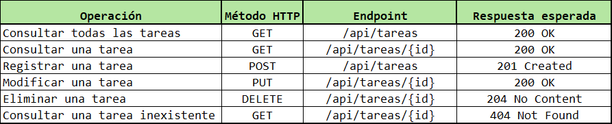
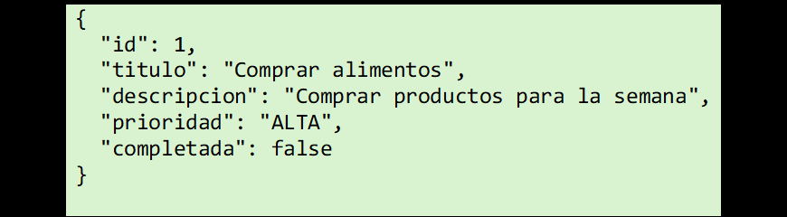

# Actividad: Control de Tareas Personales (Maven, HTTP y REST)

## Descripción del Problema
Esta aplicación permite administrar las tareas pendientes de una persona. Cada tarea cuenta con un identificador único, título, descripción, prioridad y estado de finalización.

## Tecnologías Utilizadas
- Java 17
- Apache Maven

## Datos del Proyecto Maven
- **groupId:** `com.estudiante`
- **artifactId:** `control-tareas`
- **version:** `1.0-SNAPSHOT`

### Explicación de los datos:
- **groupId:** Identifica de forma única a la organización o desarrollador del proyecto (similar a un dominio).
- **artifactId:** Es el nombre del proyecto o ejecutable.
- **version:** Indica la versión actual del desarrollo (`SNAPSHOT` significa que está en desarrollo).

## Instrucciones para compilar y ejecutar
1. Abrir la terminal en la raíz del proyecto.
2. Compilar el código:
   ```bash
   mvn compile
   
## Tabla de endpoints


## Ejemplo del objeto JSON


> Estudiante: Kevin Oswaldo Rivera Sánchez /
> Número de Carné: 9941-25-612
